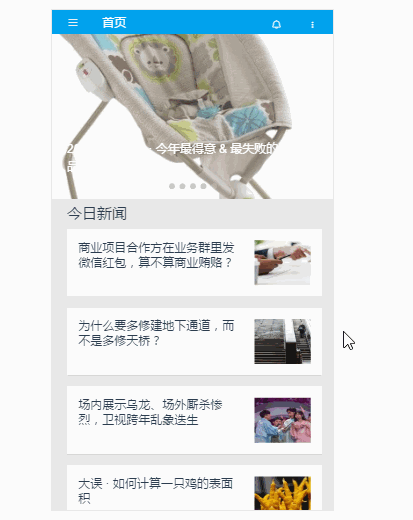
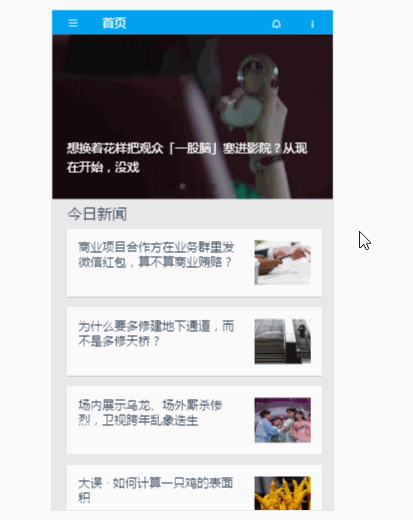
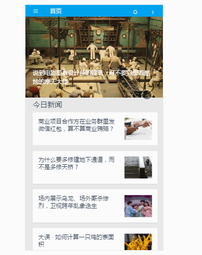
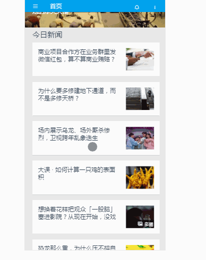
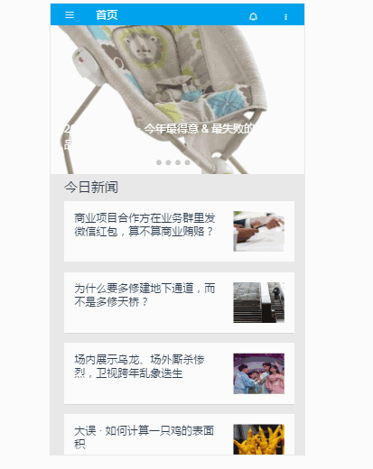

# zhihu-daily

> 这是一个基于Vue全家桶开发的知乎日报WebApp，页面主要参考安卓版知乎日报APP。

## 前言

这段时间一直在关注vue,之前也跟着相关视频做了几个小的demo(vue-eleme、tour),通过练习，对vue的相关知识和开发有了初步的认识。为了更好的熟悉vue，决定自己完整的写一个相对比较复杂的vue项目。说干就干！

为什么是知乎日报呢？

首先呢，知乎日报是一个完整的已经上线的APP，并且它的功能比较完善，但是页面还不是很复杂，比较适合新手练手。
其次，由于开发的是前端项目，数据获取是一个比较恼火的问题，然而github上已经有大神给出了[知乎日报 API 分析](https://github.com/izzyleung/ZhihuDailyPurify/wiki/%E7%9F%A5%E4%B9%8E%E6%97%A5%E6%8A%A5-API-%E5%88%86%E6%9E%90)，这极大的方便的解决了数据的获取问题，我们只需关注前端，而不需关注后台数据。

## 技术栈

vue + vue-router + axios + vuex + vue-cli + sass + mint-ui

## 功能

- [x] 首页
- [x] 首页滚动到底部加载更多
- [x] 查看新闻详情
- [x] 收藏新闻
- [x] 查看评论
- [x] 短评展开和收缩
- [x] 编写评论页（不能发送到后台）
- [x] 侧边栏
- [x] 查看指定栏目新闻
- [x] 查看指定栏目下的编辑列表
- [x] 查看个人主页
- [x] 查看收藏新闻

## 项目截图

### 首页


### 新闻详情页


### 侧边栏


### 栏目新闻


### 个人中心


### 评论页面


### 收藏页面


## 总结
目前暂时还有许多地方不是很完美，以后有时间有能力的时候再添加。由于有些图标找不到一模一样的，就用了相似的图标进行替换。

## Build Setup

``` bash
# 克隆项目到本地

git clone git@github.com:vivien1216/zhihu-daily.git

# 切换项目所在文件
cd zhihu-daily

# 安装依赖
npm install

#  本地开发，开启服务器，浏览器访问 http://localhost:8088即可
npm run dev

#构建生产
npm run build

```

For a detailed explanation on how things work, check out the [guide](http://vuejs-templates.github.io/webpack/) and [docs for vue-loader](http://vuejs.github.io/vue-loader).

## 参考
> 感谢[izzyleung](https://github.com/izzyleung) 整理的 [知乎日报API分析](https://github.com/izzyleung/ZhihuDailyPurify/wiki/%E7%9F%A5%E4%B9%8E%E6%97%A5%E6%8A%A5-API-%E5%88%86%E6%9E%90)

> [使用vue完成知乎日报web版](http://www.yatessss.com/2016/07/08/%E4%BD%BF%E7%94%A8vue%E5%AE%8C%E6%88%90%E7%9F%A5%E4%B9%8E%E6%97%A5%E6%8A%A5web%E7%89%88.html) By [yatessss](https://github.com/yatessss) 
